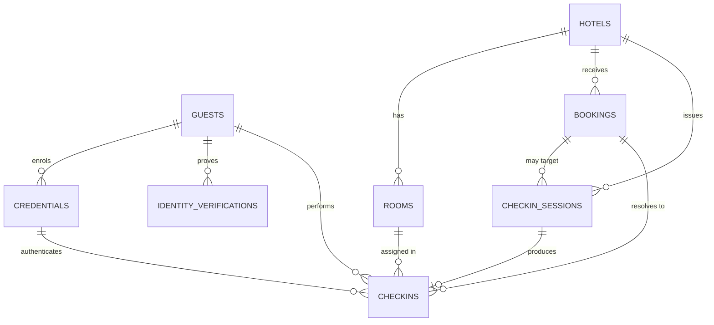

# ChqIn — data model

What the backend needs the day it stops being localStorage, designed so the
same schema survives the first two orders of magnitude of growth.

## The short answer

**One database now: PostgreSQL.** Plus two stores that aren't databases and
shouldn't be conflated with one:

| Store | Holds | Why not Postgres |
| --- | --- | --- |
| **PostgreSQL** | Guests, credentials, hotels, bookings, sessions, check-ins, audit | — |
| **Redis** | WebAuthn challenges, QR session tokens, rate-limit counters | Write-once, read-once, expires in 60s. Native TTL, no vacuum pressure, no table bloat. |
| **Object storage** (S3 / R2) | ID document images, if you keep them at all | Blobs don't belong in a row. Server-side encryption, lifecycle-expiry, and the DB stores only a pointer + hash. |

Resist adding more. No document store, no graph DB, no separate search
cluster — the access patterns here are all key lookups and small joins.

### Do the arithmetic before designing for scale

A 10,000-property chain at 100 rooms each, every room turning over daily, is
**1M check-ins/day ≈ 12/s average**. Peak is the 2–6pm arrival window, call it
20× average: **~250/s**. A single Postgres primary with a read replica handles
that with room to spare.

So the scalability work is *not* sharding. It's three things: keeping the
identity domain separable from the stay domain, partitioning the two tables
that grow unboundedly, and making the hot path a single indexed lookup. All
three are schema decisions you make now and can't retrofit cheaply.

## The one structural decision that matters

**Guests are global. Stays are per-property.**

A ChqIn Identity belongs to the guest, not the hotel — that's the entire
premise of the product. Bookings, rooms and check-ins belong to a property.
These two domains have different tenancy, different growth curves, different
retention rules, and different regulators.

Keep them cleanly separated from day one — no foreign keys from the identity
tables *into* property tables, and every property-scoped table carrying
`hotel_id` — and the day you split them into two services or two clusters is
a deployment change, not a rewrite. Blur them (e.g. hanging credentials off a
booking) and you've built a per-hotel login system, which is the thing ChqIn
exists not to be.



Left of the line: `guests`, `credentials`, `identity_verifications`. Right of
it: `hotels`, `rooms`, `bookings`, `checkin_sessions`. `checkins` is the join —
it's the only table that legitimately spans both, which is exactly what makes
it the audit record.

## Tables needed right now

Postgres flavour. `uuid_v7()` throughout — time-ordered UUIDs keep B-tree
inserts append-only (v4 scatters writes across the index) without leaking a
countable sequence to guests.

### Identity domain

```sql
CREATE TABLE guests (
  id              uuid PRIMARY KEY DEFAULT uuid_v7(),
  display_name    text NOT NULL,
  -- Contact is for receipts and recovery, never for login. Hashed columns let
  -- you look a guest up without holding a plaintext directory.
  email_hash      bytea UNIQUE,
  phone_hash      bytea UNIQUE,
  email_enc       bytea,          -- envelope-encrypted, KMS-managed key
  phone_enc       bytea,
  -- Filled in by the identity check, not at signup: a guest row exists from
  -- the moment a reservation is matched, before any ID has been seen.
  date_of_birth   date,
  gender          text CHECK (gender IN ('female','male','other','undisclosed')),
  status          text NOT NULL DEFAULT 'active'
                  CHECK (status IN ('active','suspended','erased')),
  created_at      timestamptz NOT NULL DEFAULT now(),
  updated_at      timestamptz NOT NULL DEFAULT now()
);

-- One row per passkey. This table is the login system.
CREATE TABLE credentials (
  id              uuid PRIMARY KEY DEFAULT uuid_v7(),
  guest_id        uuid NOT NULL REFERENCES guests(id) ON DELETE CASCADE,
  credential_id   bytea NOT NULL,          -- raw WebAuthn credential ID
  public_key      bytea NOT NULL,          -- COSE key
  alg             int  NOT NULL,           -- -7 ES256, -257 RS256
  sign_count      bigint NOT NULL DEFAULT 0,
  aaguid          uuid,
  transports      text[],
  backup_eligible boolean NOT NULL DEFAULT false,
  backed_up       boolean NOT NULL DEFAULT false,
  device_label    text,                    -- "iPhone 15" — for a revoke UI
  created_at      timestamptz NOT NULL DEFAULT now(),
  last_used_at    timestamptz,
  revoked_at      timestamptz
);

-- THE hot path: a discoverable-credential login arrives with only this ID.
CREATE UNIQUE INDEX credentials_credential_id_key ON credentials (credential_id);
CREATE INDEX credentials_guest_active ON credentials (guest_id) WHERE revoked_at IS NULL;
```

`sign_count` earns its place: an authenticator that reports a counter lower
than the stored one signals a cloned credential. Store it, compare it, alarm
on it.

```sql
-- KYC events, not documents. The image lives in object storage or nowhere.
CREATE TABLE identity_verifications (
  id              uuid PRIMARY KEY DEFAULT uuid_v7(),
  guest_id        uuid NOT NULL REFERENCES guests(id) ON DELETE CASCADE,
  method          text NOT NULL,           -- 'document', 'manual_desk', …
  provider        text,                    -- KYC vendor, if any
  provider_ref    text,                    -- their case ID, for disputes
  document_type   text,                    -- 'passport', 'national_id', …
  document_hash   bytea,                   -- dedupe + match, never the number
  document_last4  text,                    -- all a human ever needs to see
  artifact_uri    text,                    -- s3://… , NULL if not retained
  result          text NOT NULL CHECK (result IN ('passed','failed','manual_review')),
  verified_at     timestamptz,
  expires_at      timestamptz,             -- re-verify after N years
  created_at      timestamptz NOT NULL DEFAULT now()
);
```

### Property domain

```sql
CREATE TABLE hotels (
  id          uuid PRIMARY KEY DEFAULT uuid_v7(),
  chain_id    uuid,
  name        text NOT NULL,
  timezone    text NOT NULL,               -- check-in cutoffs are local time
  address     jsonb NOT NULL,
  created_at  timestamptz NOT NULL DEFAULT now()
);

CREATE TABLE rooms (
  id          uuid PRIMARY KEY DEFAULT uuid_v7(),
  hotel_id    uuid NOT NULL REFERENCES hotels(id),
  number      text NOT NULL,
  room_type   text,
  UNIQUE (hotel_id, number)
);

CREATE TABLE bookings (
  id              uuid PRIMARY KEY DEFAULT uuid_v7(),
  hotel_id        uuid NOT NULL REFERENCES hotels(id),
  booking_ref     text NOT NULL,           -- what the PMS calls it
  pms_ref         text,
  guest_name      text NOT NULL,           -- as booked; may not match identity
  guest_id        uuid REFERENCES guests(id),  -- linked at first check-in
  room_id         uuid REFERENCES rooms(id),
  arrival_date    date NOT NULL,
  departure_date  date NOT NULL,
  status          text NOT NULL
                  CHECK (status IN ('confirmed','checked_in','checked_out','cancelled')),
  created_at      timestamptz NOT NULL DEFAULT now(),
  UNIQUE (hotel_id, booking_ref)
);

CREATE INDEX bookings_arrivals ON bookings (hotel_id, arrival_date)
  WHERE status = 'confirmed';
```

`guest_id` nullable on `bookings` is deliberate: the reservation exists before
anyone knows who ChqIn thinks the guest is. Filling it in *is* the new-device
recovery step.

```sql
-- What a QR code resolves to. Short-lived, single-use, never guessable.
CREATE TABLE checkin_sessions (
  id              uuid PRIMARY KEY DEFAULT uuid_v7(),
  hotel_id        uuid NOT NULL REFERENCES hotels(id),
  booking_id      uuid REFERENCES bookings(id),  -- NULL for a desk/lobby QR
  token_hash      bytea NOT NULL,          -- hash, so a DB leak isn't a key ring
  kind            text NOT NULL CHECK (kind IN ('desk','booking','kiosk')),
  status          text NOT NULL DEFAULT 'open'
                  CHECK (status IN ('open','consumed','expired','revoked')),
  expires_at      timestamptz NOT NULL,
  consumed_at     timestamptz,
  created_at      timestamptz NOT NULL DEFAULT now()
);

CREATE UNIQUE INDEX checkin_sessions_token ON checkin_sessions (token_hash);
CREATE INDEX checkin_sessions_open ON checkin_sessions (hotel_id, expires_at)
  WHERE status = 'open';
```

A permanent QR printed on a desk card is a `kind='desk'` session template that
mints short-lived child sessions on scan — the printed code identifies the
property, not the check-in. Design for that now; it's the difference between
reprinting cards and not.

### The join, and the log

```sql
CREATE TABLE checkins (
  id              uuid PRIMARY KEY DEFAULT uuid_v7(),
  hotel_id        uuid NOT NULL REFERENCES hotels(id),
  booking_id      uuid NOT NULL REFERENCES bookings(id),
  guest_id        uuid NOT NULL REFERENCES guests(id),
  session_id      uuid REFERENCES checkin_sessions(id),
  credential_id   uuid REFERENCES credentials(id),   -- NULL on a desk override
  journey         text NOT NULL CHECK (journey IN ('returning','new_device','first_time','desk')),
  room_id         uuid REFERENCES rooms(id),
  idempotency_key text,
  checked_in_at   timestamptz NOT NULL DEFAULT now()
);

-- A double-tapped button must not produce two check-ins.
CREATE UNIQUE INDEX checkins_idempotency ON checkins (booking_id, idempotency_key)
  WHERE idempotency_key IS NOT NULL;

-- Append-only. Every ceremony, success or failure.
CREATE TABLE auth_events (
  id              uuid DEFAULT uuid_v7(),
  occurred_at     timestamptz NOT NULL DEFAULT now(),
  guest_id        uuid,
  credential_id   uuid,
  hotel_id        uuid,
  event           text NOT NULL,     -- 'register','assert','assert_failed','revoke'
  outcome         text NOT NULL,
  detail          jsonb,
  ip              inet,
  user_agent      text,
  PRIMARY KEY (occurred_at, id)
) PARTITION BY RANGE (occurred_at);
```

No foreign keys on `auth_events` on purpose — it must still record an attempt
against a credential that was just deleted, and it must never block a write on
a lock in another table.

### Ephemeral, in Redis

```
chqin:chal:{challenge_id}  → {purpose, guest_id?, session_id, origin}   TTL 120s
chqin:qr:{token}           → {session_id}                               TTL 300s
chqin:rl:{ip}:{route}      → counter                                    TTL 60s
```

Challenges **must** be single-use — delete on read, and treat a miss as a
failed ceremony. Putting these in Postgres works at small scale but makes your
highest-write table the one full of rows that die in two minutes.

## Growth plan, in the order you'll actually need it

| Stage | Trigger | Move |
| --- | --- | --- |
| 1 | Launch | One Postgres primary, one replica, Redis, daily PITR backups |
| 2 | `auth_events` > ~50M rows | Monthly range partitions + detach-and-archive to object storage |
| 3 | Desk console slows check-ins | Route all staff/reporting reads to the replica |
| 4 | Reporting queries hurt OLTP | CDC (Debezium/logical replication) → ClickHouse or BigQuery. Never analytics on the primary |
| 5 | > ~5k writes/s sustained | Split identity service from stay service; two clusters, no cross-DB joins |
| 6 | Multi-region latency or data residency | Partition *by property region*; guests replicate globally read-only, stays stay local |

Stage 5 is the one the schema above buys you. If identity and stay are already
FK-free across the boundary, it's a migration; if not, it's a rewrite.

Two partitioning notes for stage 6: shard property data on `hotel_id` (never on
`guest_id` — a guest legitimately appears in many properties), and expect
`guests` to be the small, hot, globally-replicated table. That asymmetry is
normal and fine: identity is small and read-mostly, stays are large and
write-mostly.

## Privacy and retention — schema-level, not policy-level

- **Never store biometrics.** No face templates, no fingerprints. The public
  key is the only credential artifact, and it isn't a secret — but it *is* a
  cross-property identifier, so treat it as personal data.
- **Encrypt what identifies.** Envelope encryption on contact details and any
  document reference; a stolen backup should yield hashes, not a guest list.
- **Prefer not retaining ID images at all.** If regulation forces it, put them
  in object storage with a lifecycle rule and store only `artifact_uri` — so
  expiry is a bucket policy, not a delete script someone forgets to run.
- **Separate erasure from retention.** "Delete my account" clears `guests` and
  cascades `credentials`, but stay records usually have a statutory retention
  period. Anonymize `checkins.guest_id` to a tombstone rather than deleting the
  row, or you'll fail an audit.
- **Guest registers are regulated locally** — India, for instance, has both
  hotel-register rules and Form C reporting for foreign nationals. Confirm the
  specifics for your jurisdiction, then add a `regulatory_filings` table; don't
  bolt it onto `checkins`.

## What not to build yet

Staff accounts and RBAC, loyalty, payments, room keys, multi-guest bookings,
PMS sync. Each is a real table eventually; none is needed to replace
localStorage, and each one added now is schema you'll migrate before it has a
user.

The exception worth pre-empting: **multi-guest bookings**. Two people sharing
a room both check in. Modelling `checkins` per *guest* rather than per booking
— as above — means that costs you a row, not a migration.
